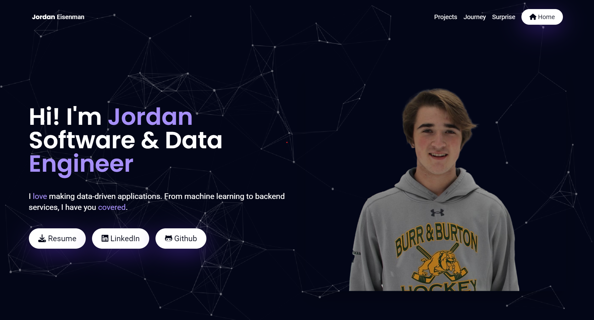

# Portfolio App 👋

Welcome to my portfolio web app!

🌐 Check it out here: [Portfolio Web App](https://jordan-portfolio-7wxawbmyea-uc.a.run.app/)

I give a lot of credit to freeCodeCamp, as I used their template. Here is what the website looks like:

In this project, I learned how to do a variety of things:

1. 💡 I learned how to layout with HTML and Tailwind.
2. 🐳 I learned about adapters, especially related to dockerization.
3. 🖱️ I learned some basics of how to make the page interactive, with hover effects, event listeners, and {#if} statements in Svelte.

In spite of everything I learned, however, I realize I still have no idea how to do front-end, but I hope you are happy with the end result! 😅👍
